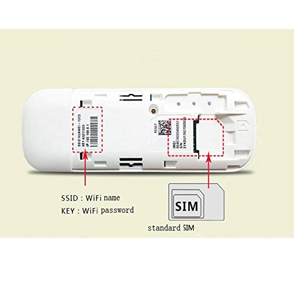
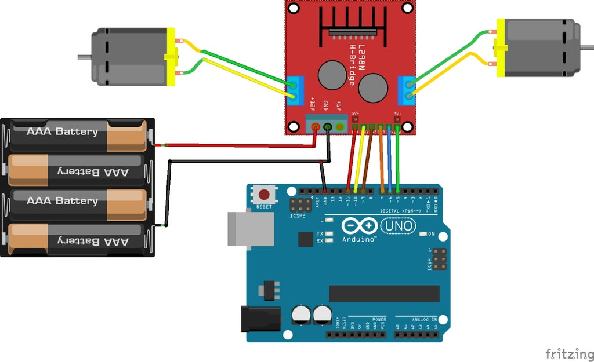
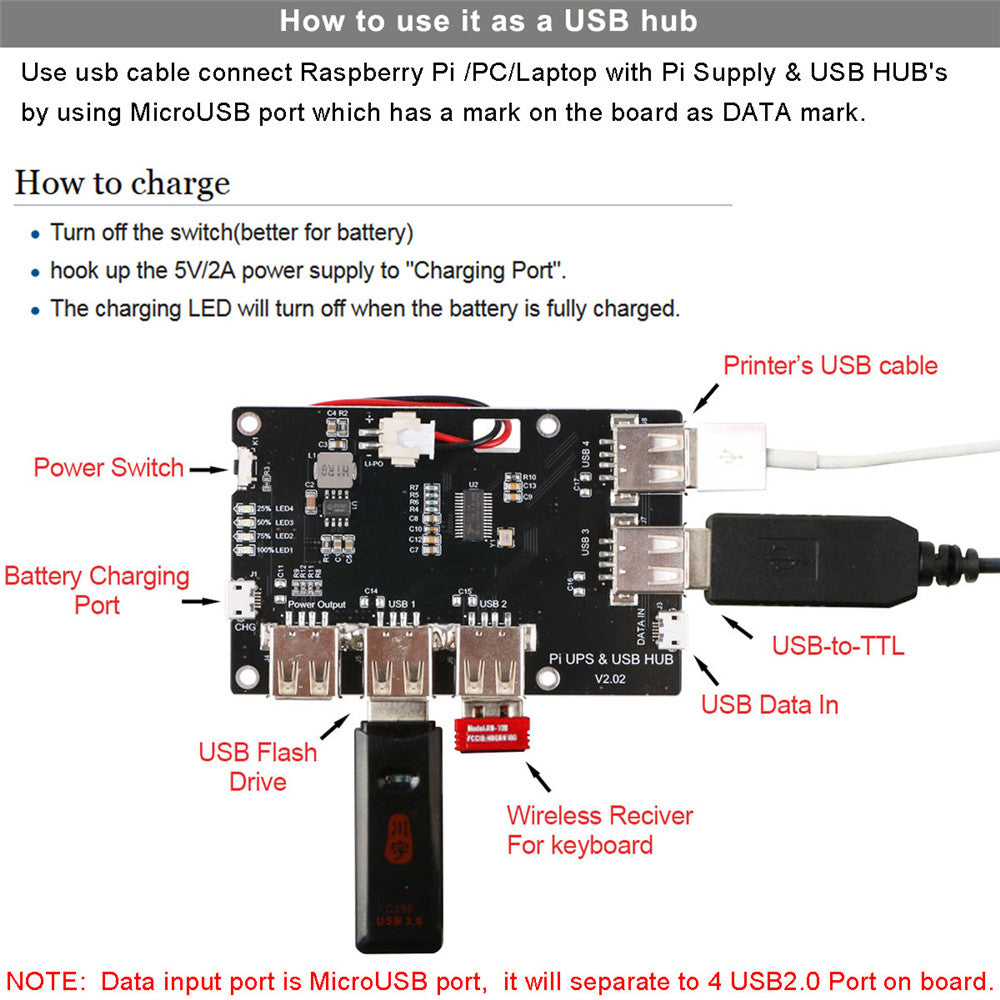
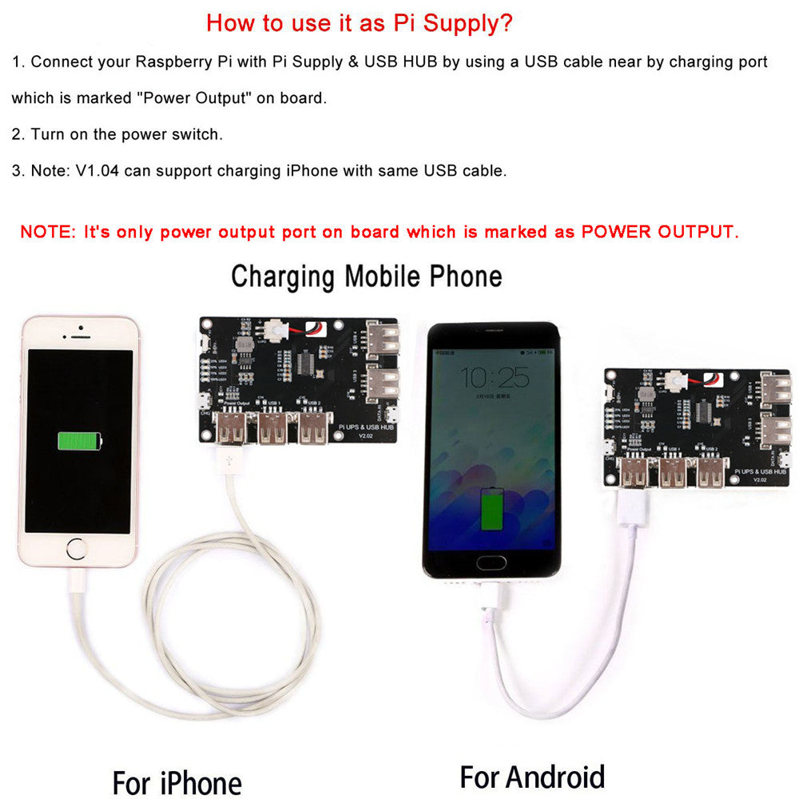

## Raspiberry pi 3

4GB Ram, with Raspbian OS

I use network manager to manage my network
```
apt-get install network-manager
systemctl start NetworkManager.service
systemctl enable NetworkManager.service

nano /etc/dhcpcd.conf
denyinterfaces wlan0

nano /etc/NetworkManager/NetworkManager.conf
[main]
plugins=ifupdown,keyfile
dhcp=internal
[ifupdown]
managed=true

nano /etc/network/interfaces
source-directory /etc/network/interfaces.d

```

## 4G Doogle
### The hardware itself

E8372h 155



Please note that this is different from E8372. 

### Testing it as a stand alone doogle
- Remove the cover. 
- Take a picture of the SSID, and the key name with your phone.
- Need a micro sim to standard sim card converter
- Please note that when you insert your sim card, the metal part of the sim card is facing down.
- The dented part of the card is away from the direction of insertion.
- When you slide the sim card in, there is a tendency for the microsim to be dislodged.
- Close the cover, and plug it into any usb slot with electricity.
- Then you will see there is a cyan light. 
- If you get a blinking green light, that means it cannot connect to the internet. It only turn on. Check if the sim card is correctly inserted.
- Use your phone or computer to login to the hotspot wifi with SSID like Huawei 85CE, and key in the wifi key you recorded.
- Go to 192.168.8.1

### Plug it into the pi
```
lsusb --verbose
```
Look for 
```
idVendor           0x12d1 Huawei Technologies Co., Ltd.
idProduct          0x14db E353/E3131
```
It can presents as a CD drive with the USB ID of 12d1:1f01. 
Switching to stick mode, it becomes 12d1:155e. 
In Hilink mode, it is 12d1:14db
You want it to be Hilink mode.
Run this to convert to modem mode. You only need to do this once. The device will remember
```
sudo usb_modeswitch -v 12d1 -p 1f01 -M 55534243123456780000000000000011063000000000010000000000000000
sudo dhclient eth1
```
Then you can use nmtui to activate eth1. Ping the connection using that specific device.
```
ping -I eth1 www.google.com
```

### Can also use the doogle as wifi to 4g bridge
- Dont need to worry if you cannot use the doogle natively
- You can just plug it in, have the wifi of pi to connect to the ssid of the doogle
- sudo nmtui
Add connection, 
device: wlan0
SSID: HUAWEI-85CE
Mode: Client
Security: WPA & WPA2 Personal
Password: Remove the cover and look at 8 digits number

## Motor Driver 

- The wiring is more or less as above. Please note that you really need 12V. I put 10 AA battery in serial. 
- At first I only put 6 AA, all I hear is a buzz sound and the motor is not running. Thats the sound of not having enough current.
- You should use a multimeter to see if the battery is giving enough voltage
- You should connect the battery directly to the motor to see if each motor is working
- You should connect the ground of the driver to the ground of the pi. 
- You should connect the 5V of the driver to the 5V of the pi.

## Battery Pack board

- Plug the micro usb to the board to charge. Disconnect everything else.
- The red light should be turned off
- The blue light should be turned on.


- To use it, you remove the micro usb.
- Use a USB A to micro usb cable to connect the USB A of the battery pack board to the micro usb of the pi.
