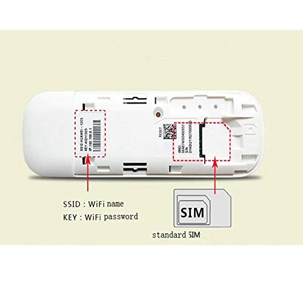
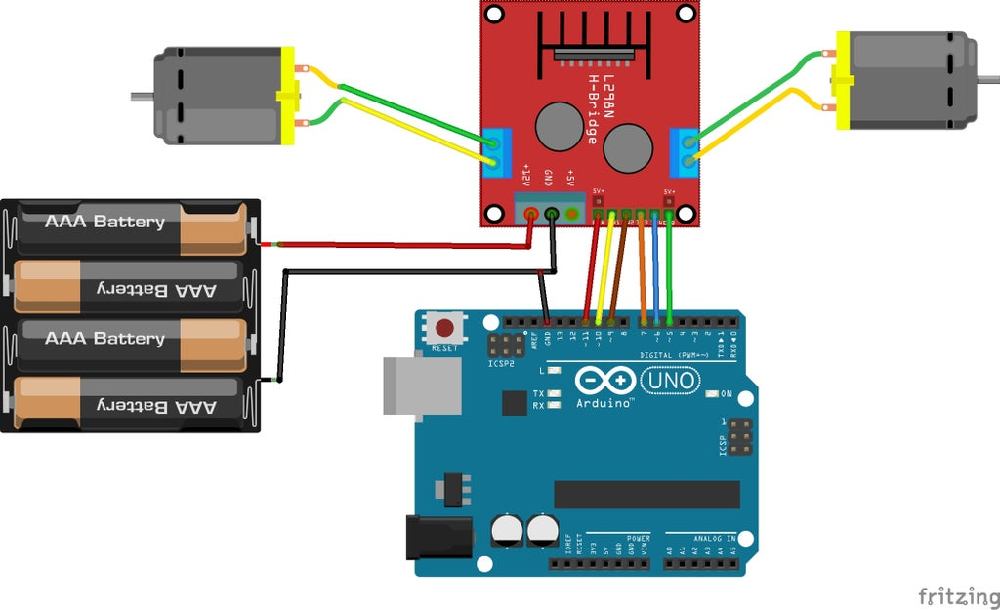

## Raspiberry pi 3

## 4G Doogle
### The hardware itself
E8372h 155

Please note that this is different from E8372. The first step is to test the hardware. 

### Testing it as a stand alone doogle
Remove the cover
Take a picture of the SSID, and the key name with your phone.
Need a micro sim to standard sim card converter
Please note that when you insert your sim card, the metal part of the sim card is facing down.
The dented part of the card is away from the direction of insertion.
When you slide the sim card in, there is a tendency for the microsim to be detached.
Close the cover, and plug it into any usb slot
Then you will see there is a cyan light. 
If you get a blinking green light that means it cannot connect to the internet
Use your phone or computer to login to the SSID like Huawei 85CE, and key in the wifi key you recorded.
Go to 192.168.8.1

### Plug it into the pi
```
lsusb --verbose
```
Look for 
```
idVendor           0x12d1 Huawei Technologies Co., Ltd.
idProduct          0x14db E353/E3131
```
Run this to convert to modem mode. You only need to do this once.
```
usb_modeswitch -v 12d1 -p 14db -M "55534243123456780000000000000a11062000000000000100000000000000"
```
Then you can use nmtui to activate eth1. Ping the connection using that specific device.
```
ping -I eth1 www.google.com
```

## Motor Driver 

The wiring is more or less as above. Please note that you really need 12V. I put 10 AA battery in serial. 
At first I only put 6 AA, all I hear is a buzz sound and the motor is not running
You should use a multimeter to see if the battery is giving enough voltage
You should connect the battery directly to the motor to see if each motor is working
You should connect the ground of the driver to the ground of the pi. 
You should connect the 5V of the driver to the 5V of the pi.
